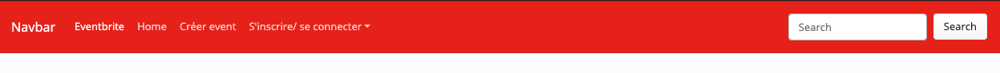

# creating a UI kit for Eventbrite

### kitUI_bootstrap-simplex-custom
>even if my backend is not completed, yet [beautiful](https://eventbritebytg.herokuapp.com/), I have to change my mind
>* [Github of the site](https://github.com/drguichard/Eventbrite)
>* [Github of the UI kit for the site](https://github.com/drguichard/kitUI_bootstrap-simplex-custom)

---------------------------------------------------------------------------------------------------------------------------------------------------------------------------------------

	INSPIRATIONS
- [Bootswatch Simplex UI](https://bootswatch.com/simplex/ )

---------------------------------------------------------------------------------------------------------------------------------------------------------------------------------------
	PAGES

* index : an index (Gracious Lord !) with a link to each page.
* authentification_form.html
* banner
* footer
* navbar 

---------------------------------------------------------------------------------------------------------------------------------------------------------------------------------------
	MOLECULE LIST

* authentification_form.html
* banner
* footer : started from nihil
* navbar : started from Boostwatch Simplex UI

